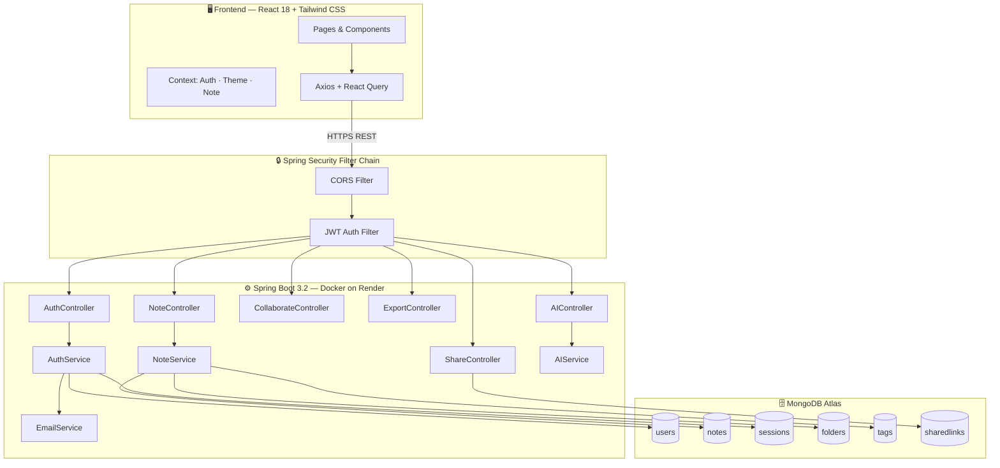
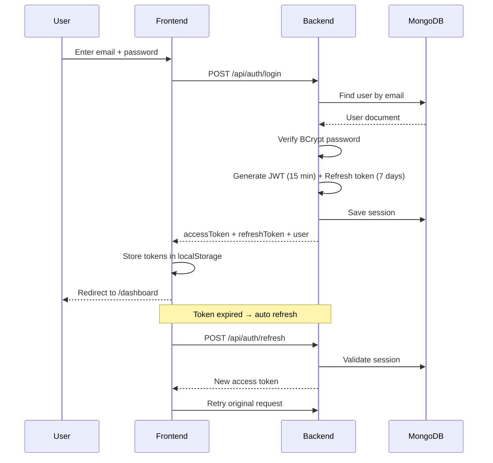
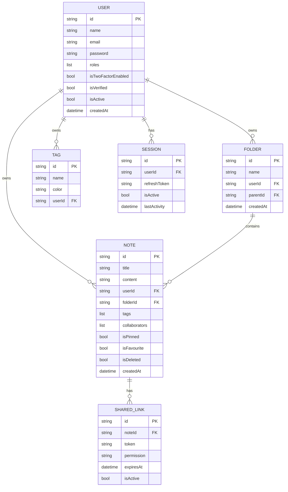
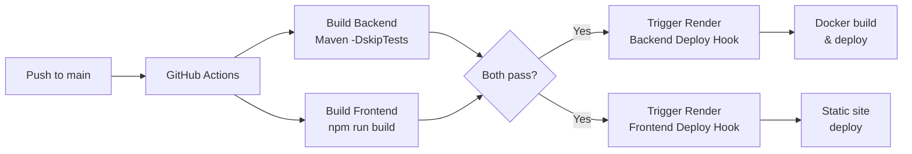

<div align="center">

# 📝 NoteVerse

**A modern, full-stack SaaS notes application with rich text editing, collaboration, AI features, and secure authentication.**

[](https://noteverse-1-yhbr.onrender.com)
[](https://noteverse-8e4i.onrender.com/swagger-ui.html)
[](https://github.com/DarshanGami/NoteVerse)


</div>

---

## ✨ Features

| Category | Features |
|----------|----------|
| **Auth** | JWT login/register, refresh tokens, forgot/reset password via OTP, 2FA setup |
| **Notes** | Rich text editor (TipTap), pin, favourite, soft delete, restore from trash |
| **Organization** | Folders, tags, full-text search |
| **Collaboration** | Invite collaborators with READ/WRITE permissions, Shared With Me page |
| **Sharing** | Public share links with optional expiry and VIEW/EDIT permission |
| **Export** | Download notes as PDF, Markdown, or plain text |
| **AI (scaffolded)** | Summarize, grammar check, rewrite, auto-tag (provider-ready) |
| **PWA** | Offline support via Service Worker + IndexedDB sync queue |
| **Security** | CORS, session tracking, audit logs, BCrypt password hashing |
| **UI** | Dark / light mode, Notion-style sidebar, Framer Motion animations |

---

## 🏗️ System Architecture



---

## 🔐 Authentication Flow



---

## 🗃️ Database Schema



---

## 🚢 CI/CD Pipeline



---

## 🛠️ Tech Stack

### Backend
| Layer | Technology |
|-------|-----------|
| Framework | Spring Boot 3.2, Java 17 |
| Security | Spring Security 6, JWT (jjwt 0.12) |
| Database | MongoDB Atlas, Spring Data MongoDB |
| Email | Spring Mail (JavaMailSender) |
| API Docs | SpringDoc OpenAPI (Swagger UI) |
| Build & Deploy | Maven, Docker, Render |

### Frontend
| Layer | Technology |
|-------|-----------|
| Framework | React 18 (Create React App) |
| Editor | TipTap 2 (rich text) |
| Styling | Tailwind CSS 3 |
| State | React Context + TanStack Query v5 |
| HTTP | Axios with refresh token interceptor |
| Animations | Framer Motion |
| PDF Export | jsPDF + html2canvas |
| Offline | Service Worker + IndexedDB (idb) |

---

## 📁 Project Structure

```
NoteVerse/
├── .github/workflows/
│   └── deploy.yml            # CI/CD pipeline
├── backend/
│   ├── Dockerfile            # Multi-stage build
│   ├── pom.xml
│   └── src/main/java/com/noteverse/
│       ├── config/           # Security, CORS, Swagger
│       ├── controller/       # REST controllers
│       ├── dto/              # Request / Response DTOs
│       ├── exception/        # Global exception handler
│       ├── filter/           # JWT auth filter
│       ├── model/            # MongoDB documents (9 collections)
│       ├── repository/       # Spring Data repositories
│       ├── security/         # JwtUtils, UserDetailsService
│       └── service/          # Business logic
├── frontend/
│   ├── public/
│   │   └── _redirects        # Render SPA rewrite rule
│   └── src/
│       ├── api/              # Axios calls per feature
│       ├── components/       # UI components (common, layout, notes)
│       ├── context/          # AuthContext, ThemeContext, NoteContext
│       ├── pages/            # All page components
│       ├── routes/           # PrivateRoute, PublicRoute, AppRouter
│       └── utils/            # Helpers, validators
├── render.yaml               # Render services config
└── docs/
    └── architecture.html     # Full architecture documentation
```

---

## 🚀 Local Development

### Prerequisites
- Java 17+, Maven 3.9+
- Node.js 20+, npm
- MongoDB (local or Atlas free tier)

### Backend

```bash
cd backend

# Create local secrets file (gitignored)
cat > src/main/resources/application-local.yml << 'EOF'
spring:
  data:
    mongodb:
      uri: mongodb://localhost:27017/noteverse
app:
  jwt:
    secret: local-dev-secret-key-at-least-32-chars
  frontend-url: http://localhost:3000
EOF

mvn spring-boot:run -Dspring-boot.run.profiles=local
# → http://localhost:8080
# → Swagger UI: http://localhost:8080/swagger-ui.html
```

### Frontend

```bash
cd frontend
npm install
echo "REACT_APP_API_URL=http://localhost:8080/api" > .env.local
npm start
# → http://localhost:3000
```

---

## 🔑 Environment Variables

### Backend (Render)
| Variable | Description | Required |
|----------|-------------|----------|
| `MONGODB_URI` | MongoDB Atlas connection string | ✅ |
| `JWT_SECRET` | JWT signing secret (min 32 chars) | ✅ |
| `FRONTEND_URL` | Frontend URL for CORS | ✅ |
| `MAIL_HOST` | SMTP host (e.g. smtp.gmail.com) | ❌ |
| `MAIL_USERNAME` | SMTP username | ❌ |
| `MAIL_PASSWORD` | SMTP app password | ❌ |

### Frontend (Render)
| Variable | Description | Required |
|----------|-------------|----------|
| `REACT_APP_API_URL` | Backend API base URL | ✅ |

---

## 📡 API Reference

<details>
<summary><strong>Authentication</strong> — <code>/api/auth</code></summary>

| Method | Endpoint | Description |
|--------|----------|-------------|
| `POST` | `/register` | Register new user |
| `POST` | `/login` | Login, returns JWT |
| `POST` | `/refresh` | Refresh access token |
| `POST` | `/logout` | Invalidate session |
| `POST` | `/forgot-password` | Send OTP to email |
| `POST` | `/reset-password` | Reset with OTP |
| `POST` | `/2fa/setup` | Generate TOTP secret |
| `POST` | `/2fa/verify` | Enable 2FA |

</details>

<details>
<summary><strong>Notes</strong> — <code>/api/notes</code></summary>

| Method | Endpoint | Description |
|--------|----------|-------------|
| `GET` | `/` | List notes (paginated, filtered) |
| `POST` | `/` | Create note |
| `GET` | `/{id}` | Get note |
| `PUT` | `/{id}` | Update note |
| `DELETE` | `/{id}` | Soft delete (trash) |
| `PUT` | `/{id}/restore` | Restore from trash |
| `PUT` | `/{id}/pin` | Toggle pin |
| `PUT` | `/{id}/favourite` | Toggle favourite |
| `GET` | `/trash` | List deleted notes |
| `GET` | `/search` | Full-text search |
| `GET` | `/shared-with-me` | Notes shared with you |

</details>

<details>
<summary><strong>Folders, Tags, Sharing, Collaboration, Export, AI</strong></summary>

| Method | Endpoint | Description |
|--------|----------|-------------|
| `CRUD` | `/api/folders/**` | Folder management |
| `CRUD` | `/api/tags/**` | Tag management |
| `POST` | `/api/share/{noteId}` | Create share link |
| `GET` | `/api/share/public/{token}` | Access shared note |
| `POST` | `/api/collaborate/{noteId}/invite` | Invite collaborator |
| `GET` | `/api/export/{noteId}/pdf` | Export as PDF |
| `GET` | `/api/export/{noteId}/markdown` | Export as Markdown |
| `POST` | `/api/ai/summarize` | AI summarize |
| `POST` | `/api/ai/grammar` | AI grammar check |
| `GET` | `/api/health` | Health check |

</details>

---

## 📄 License

This project is licensed under the **MIT License**.

---

<div align="center">
  Built with ❤️ by <a href="https://github.com/DarshanGami">Darshan Gami</a>
</div>
